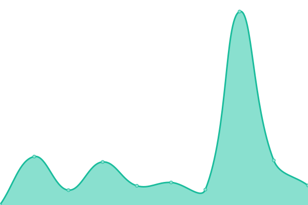

# [📈 Live Status](https://upptime.github.io/upptime): <!--live status--> **🟩 All systems operational**

This repository contains the open-source uptime monitor and status page for [Upptime](https://upptime.js.org), powered by [Upptime](https://github.com/upptime/upptime).

With [Upptime](https://upptime.js.org), you can get your own unlimited and free uptime monitor and status page, powered entirely by a GitHub repository. We use [Issues](https://github.com/upptime/upptime/issues) as incident reports, [Actions](https://github.com/spectaA/uptime-test/actions) as uptime monitors, and [Pages](https://upptime.github.io/upptime) for the status page.

<!--start: status pages-->
<!-- This summary is generated by Upptime (https://github.com/upptime/upptime) -->
<!-- Do not edit this manually, your changes will be overwritten -->
<!-- prettier-ignore -->
| URL | Status | History | Response Time | Uptime |
| --- | ------ | ------- | ------------- | ------ |
|  [API PZT PROD](https://prod-pzt.mokapis.com/api/info) | 🟩 Up | [api-pzt-prod.yml](https://github.com/spectaA/uptime-test/commits/HEAD/history/api-pzt-prod.yml) | 

 722ms
     
 | 

<a href="https://spectaA.github.io/uptime-test/history/api-pzt-prod">100.00%</a>
    

|  [API MWD PROD](https://prod-mwd.mokapis.com/api/info) | 🟩 Up | [api-mwd-prod.yml](https://github.com/spectaA/uptime-test/commits/HEAD/history/api-mwd-prod.yml) | 

 550ms
     
 | 

<a href="https://spectaA.github.io/uptime-test/history/api-mwd-prod">100.00%</a>
    

|  [FRONT PZT SHOP](https://www.pizzattitude.com) | 🟩 Up | [front-pzt-shop.yml](https://github.com/spectaA/uptime-test/commits/HEAD/history/front-pzt-shop.yml) | 

 307ms
     
 | 

<a href="https://spectaA.github.io/uptime-test/history/front-pzt-shop">100.00%</a>
    

|  [FRONT PZT BACKOFFICE](https://admin.pizzattitude.com) | 🟩 Up | [front-pzt-backoffice.yml](https://github.com/spectaA/uptime-test/commits/HEAD/history/front-pzt-backoffice.yml) | 

 392ms
     
 | 

<a href="https://spectaA.github.io/uptime-test/history/front-pzt-backoffice">100.00%</a>
    

|  [FRONT LORA](https://www.lora-construct.be/) | 🟩 Up | [front-lora.yml](https://github.com/spectaA/uptime-test/commits/HEAD/history/front-lora.yml) | 

 707ms
     
 | 

<a href="https://spectaA.github.io/uptime-test/history/front-lora">100.00%</a>
    

<!--end: status pages-->

[**Visit our status website →**](https://upptime.github.io/upptime)

## 📄 License

- Powered by: [Upptime](https://github.com/upptime/upptime)
- Code: [MIT](./LICENSE) © [Upptime](https://upptime.js.org)
- Data in the `./history` directory: [Open Database License](https://opendatacommons.org/licenses/odbl/1-0/)
