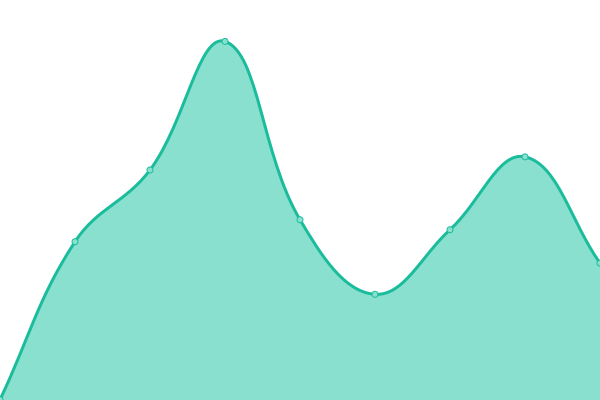
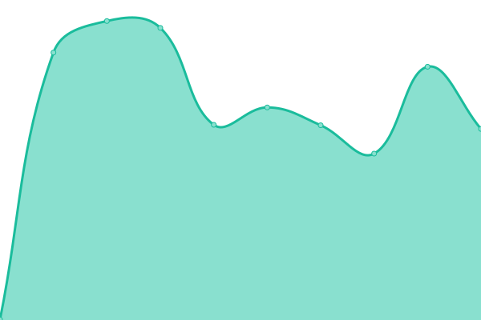

# [📈 Live Status](https://upptime.github.io/upptime): <!--live status--> **🟧 Partial outage**

This repository contains the open-source uptime monitor and status page for [Upptime](https://upptime.js.org), powered by [Upptime](https://github.com/upptime/upptime).

With [Upptime](https://upptime.js.org), you can get your own unlimited and free uptime monitor and status page, powered entirely by a GitHub repository. We use [Issues](https://github.com/upptime/upptime/issues) as incident reports, [Actions](https://github.com/spectaA/uptime-test/actions) as uptime monitors, and [Pages](https://upptime.github.io/upptime) for the status page.

<!--start: status pages-->
<!-- This summary is generated by Upptime (https://github.com/upptime/upptime) -->
<!-- Do not edit this manually, your changes will be overwritten -->
<!-- prettier-ignore -->
| URL | Status | History | Response Time | Uptime |
| --- | ------ | ------- | ------------- | ------ |
|  [prod-pzt.mokapis.com](https://prod-pzt.mokapis.com/api/info) | 🟩 Up | [prod-pzt-mokapis-com.yml](https://github.com/spectaA/uptime-test/commits/HEAD/history/prod-pzt-mokapis-com.yml) | 

 686ms
     
 | 

<a href="https://spectaA.github.io/uptime-test/history/prod-pzt-mokapis-com">99.55%</a>
    

|  [stag-pzt.mokapis.com](https://stag-pzt.mokapis.com/api/info) | 🟩 Up | [stag-pzt-mokapis-com.yml](https://github.com/spectaA/uptime-test/commits/HEAD/history/stag-pzt-mokapis-com.yml) | 

 957ms
     
 | 

<a href="https://spectaA.github.io/uptime-test/history/stag-pzt-mokapis-com">99.55%</a>
    

|  [www.pizzattitude.com](https://www.pizzattitude.com) | 🟩 Up | [www-pizzattitude-com.yml](https://github.com/spectaA/uptime-test/commits/HEAD/history/www-pizzattitude-com.yml) | 

 364ms
     
 | 

<a href="https://spectaA.github.io/uptime-test/history/www-pizzattitude-com">100.00%</a>
    

|  [admin.pizzattitude.com](https://admin.pizzattitude.com) | 🟩 Up | [admin-pizzattitude-com.yml](https://github.com/spectaA/uptime-test/commits/HEAD/history/admin-pizzattitude-com.yml) | 

 800ms
     
 | 

<a href="https://spectaA.github.io/uptime-test/history/admin-pizzattitude-com">100.00%</a>
    

|  [stag-mwd.mokapis.com](https://stag-mwd.mokapis.com/api/info) | 🟩 Up | [stag-mwd-mokapis-com.yml](https://github.com/spectaA/uptime-test/commits/HEAD/history/stag-mwd-mokapis-com.yml) | 

 624ms
     
 | 

<a href="https://spectaA.github.io/uptime-test/history/stag-mwd-mokapis-com">99.31%</a>
    

|  [prod-mwd.mokapis.com](https://prod-mwd.mokapis.com/api/info) | 🟥 Down | [prod-mwd-mokapis-com.yml](https://github.com/spectaA/uptime-test/commits/HEAD/history/prod-mwd-mokapis-com.yml) | 

 491ms
     
 | 

<a href="https://spectaA.github.io/uptime-test/history/prod-mwd-mokapis-com">99.57%</a>
    

|  [www.marionwillems.be](https://www.marionwillems.be/) | 🟩 Up | [www-marionwillems-be.yml](https://github.com/spectaA/uptime-test/commits/HEAD/history/www-marionwillems-be.yml) | 

 387ms
     
 | 

<a href="https://spectaA.github.io/uptime-test/history/www-marionwillems-be">100.00%</a>
    

<!--end: status pages-->

[**Visit our status website →**](https://upptime.github.io/upptime)

## 📄 License

- Powered by: [Upptime](https://github.com/upptime/upptime)
- Code: [MIT](./LICENSE) © [Upptime](https://upptime.js.org)
- Data in the `./history` directory: [Open Database License](https://opendatacommons.org/licenses/odbl/1-0/)
